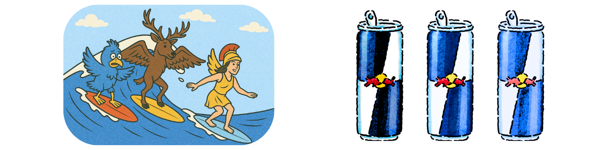
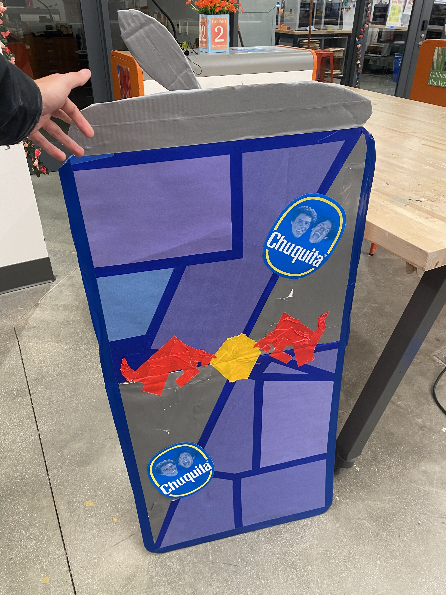

# Red Bull x Claremont Colleges 

### A Micro Shopper Insights Proof-of-Concept Across the 5C Campuses

## What's This?

This was a **scrappy, creative passion project** inspired by the Red Bull **Insights & Analytics Graduate Program**.

I ran a lightweight survey activation across the Claremont Colleges (Pomona, Pitzer, Scripps, CMC, Harvey Mudd), offering free Red Bull and collecting feedback on:

- When students drink energy drinks (study, party, workout, etc.)
- Where they go to buy them on campus
- What would make them choose Red Bull over competitors
- And if Red Bull were a person, what kind of vibe it would have 👀

Only **44 people responded**, so the insights aren't statistically strong—but this was more of a **proof of concept** to show how I think about segmentation, pricing, brand image, and on-premise execution.

---

## The Fun Stuff

To bring the project to life, I:
- Created a short, insight-driven survey focused on consumption habits, purchase paths, and brand perception
- Built a **life-sized Red Bull can**  to attract attention 
- **Gave away free Red Bull** to incentivize survey signups
- Was planning a **DJ set activation** to drive more responses (ran out of time)

This project was a way to blend **creativity, hustle, and analytical thinking**—everything I’m excited to bring to the Red Bull team.

## What's in This Repo

Just a simple pipeline:

- `main.py`: reads the survey export CSV and loads it into a SQLite database
- `analyze.py`: runs preset SQL queries and light sentiment analysis, then generates a clean insights summary
- `red_bull_summary.txt`: auto-generated insights report with survey breakdowns, purchase patterns, and brand sentiment.

## 🚀 Why It Matters

This project let me:
- Simulate small-scale **shopper & on-premise insights**
- Get creative with execution (events, giveaways, branding)
- Show genuine excitement for a role that blends **analytics + marketing + field engagement**

Thanks for reading!